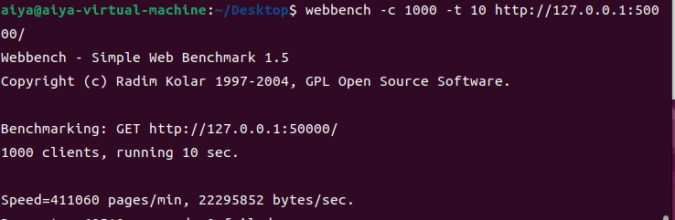

# WChat
用C++实现的高性能聊天分布式服务器，经过webbenchh压力测试可以实现上万的QPS

# 功能
* 使用boost编写配置模块，配置模块负责控制项目的整体配置；
* 利用Asio实现Reactor高并发模型，采用一个线程一个事件循环；
* 使用hiredis、cppcon库来控制Redis和Mysql，并封装了连接池；
* 使用protobuf序列化proto文件，使用grpc框架进行进程间通信；
* 使用nodejs调用qq的邮箱服务完成验证码模块；
* 使用spdlog作为项目的日志输出库；
* 项目分别实现了VarifyServer、StatusServer、GateServer、ChatServer等服务器，客户端使用QML实现。

# 环境要求

Ubuntu22.04
C++17
MySQL
Redis
Nodejs
Boost
spdlog
protobuf3.11
grpc
hiredis
cppcon

# 压力测试

    ./webbench-1.5/webbench -c 100 -t 10 http://ip:port/
	./webbench-1.5/webbench -c 1000 -t 10 http://ip:port/
	./webbench-1.5/webbench -c 2000 -t 10 http://ip:port/
	./webbench-1.5/webbench -c 4000 -t 10 http://ip:port/

* **测试环境: Ubuntu:22.04 cpu:4核 内存:4G**

<table>
  <tbody>
    <tr>
      <td colspan="2" align="center">
        
      </td>
    </tr>
    <tr>
      <td colspan="2" align="center">
        
      </td>
    </tr>
    <tr>
      <td colspan="2" align="center">
        
      </td>
    </tr>
    <tr>
      <td colspan="2" align="center">
        
      </td>
    </tr>
    <tr>
      <td colspan="2" align="center">
        
      </td>
    </tr>
  </tbody>
</table>

#客户端

<table>
  <tbody>
    <tr>
      <td colspan="2" align="center">
        
      </td>
    </tr>
    <tr>
      <td colspan="2" align="center">
        
      </td>
    </tr>
    <tr>
      <td colspan="2" align="center">
        
      </td>
    </tr>
    <tr>
      <td colspan="2" align="center">
        
      </td>
    </tr>
    <tr>
      <td colspan="2" align="center">
        
      </td>
    </tr>
  </tbody>
</table>